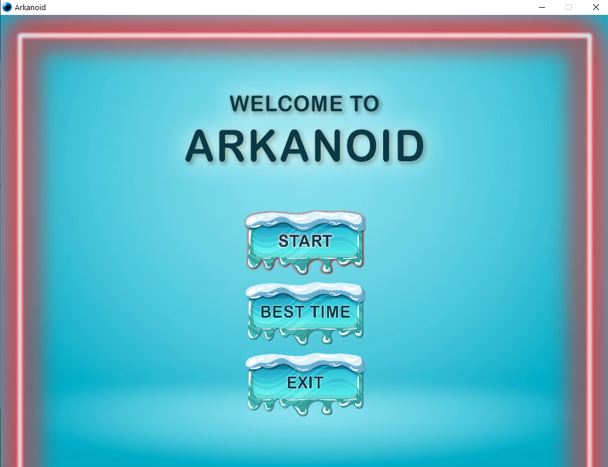
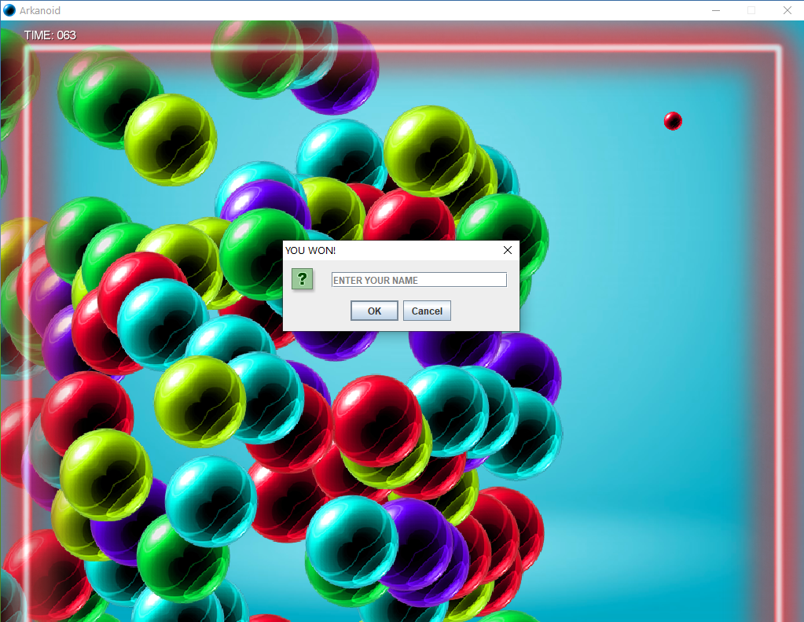

# Arkanoid game

This is my first project as a software engineering student. It's far from ideal but runs smoothly. I created it using [LibGDX](https://libgdx.com/) framework and implemented physics based on Box2D library.

## Screenshots

Main menu

Game screen

Victory scene

